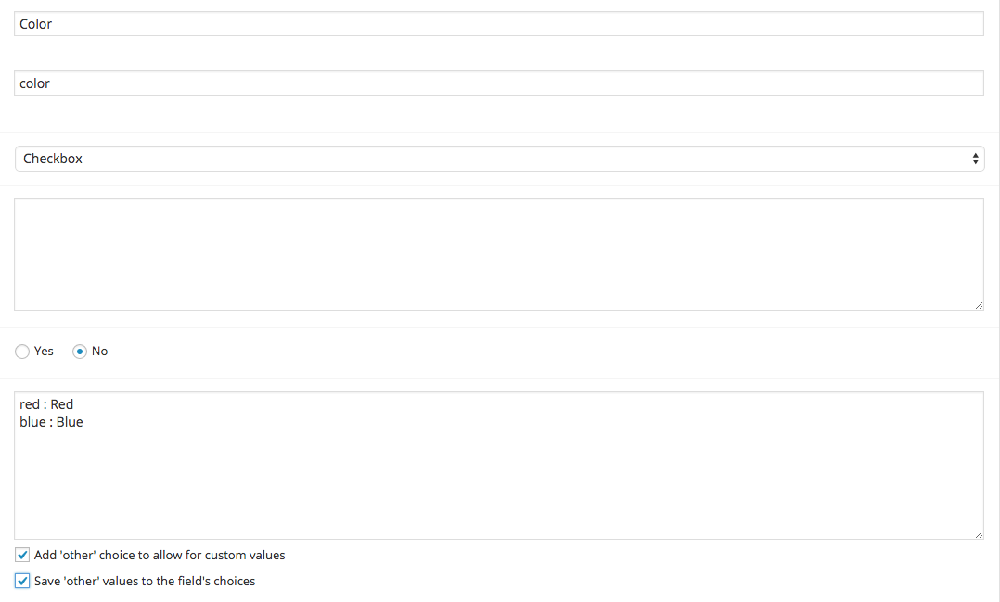
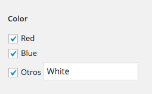

# wordpress-acf-checkbox
Custom field acf checkbox with others options
This file checkbox field add functionality the possibility to allow an alternate mode other value

## Instalation
Replaces the original file this within the plugin folder acf.

```
/wp-content/plugins/advanced-custom-fields/core/fields
```

## Create custom field
Create the custom field checkbox as the original.

As seen in the picture below, we are able to add a field other



Field lets you add a value others


